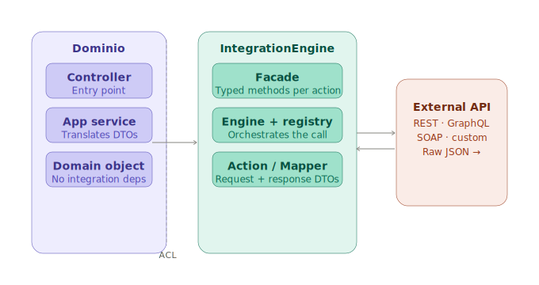

# IntegrationEngine Bundle — Documentation

> **Reading guide**
>
> - **New here?** Start with the [Quick start](#quick-start) and [How it fits together](#1-how-it-fits-together). That is enough to ship a working integration.
> - **Configuring an integration?** Go to [YAML configuration](#5-yaml-configuration) or [Authorization](#9-authorization-system).
> - **Looking for a specific behaviour?** Use the [table of contents](#table-of-contents) below.
> - **Extending or forking the bundle?** Jump to [Bundle internals](#14-bundle-internals) — it is written for a different audience and assumes familiarity with the rest.

---

## Table of contents

| Section | What it covers | Who needs it |
|---------|---------------|--------------|
| [Quick start](#quick-start) | Install, generate, call | Everyone |
| [1. How it fits together](#1-how-it-fits-together) | The full stack and the ACL pattern | Everyone |
| [2. Philosophy](#2-philosophy) | Design principles and architecture | When you want to understand why |
| [3. Scaffolding](#3-scaffolding) | `make:integration` reference | When adding a new integration or action |
| [4. Directory structure](#4-directory-structure) | Generated layout and naming conventions | When navigating an unfamiliar codebase |
| [5. YAML configuration](#5-yaml-configuration) | Both config files explained | When configuring transport, auth, headers |
| [6. Actions](#6-actions) | What an Action declares and why | When writing or debugging an action |
| [7. Context system](#7-context-system) | Dynamic path parameters | When using `{placeholders}` in paths |
| [8. Body system](#8-body-system) | Request payloads and GraphQL bodies | When sending POST/PUT/PATCH or GraphQL |
| [9. Authorization system](#9-authorization-system) | Static and dynamic auth | When configuring authentication |
| [10. Headers system](#10-headers-system) | Three-layer header precedence | When debugging header issues |
| [11. Engine API](#11-engine-api) | `send()` signature and return type | Quick reference |
| [12. The response boundary](#12-the-response-boundary) | What `ResponseInterface` means | When designing mappers and DTOs |
| [13. Extensibility](#13-extensibility) | Custom adapters, cache, config | When replacing infrastructure |
| [14. Bundle internals](#14-bundle-internals) | Boot sequence, DI wiring, extension points | Bundle contributors and library authors |
| [15. Error reference](#15-error-reference) | Every exception and what to do | When something breaks |

---

## Quick start

### 1. Install

```bash
composer require carlosgude/integration-engine
```

If Symfony Flex does not auto-register the bundle, add it manually to
`config/bundles.php`:

```php
return [
    // ...
    IntegrationEngine\Bundle\IntegrationEngineBundle::class => ['all' => true],
];
```

### 2. Generate your first integration

One command creates everything — config, classes, and YAML:

```bash
php bin/console make:integration DummyRestApi GetEmployees
```

The command asks on first run:

1. **Base URL**: `https://dummy.restapiexample.com`
2. **Path**: `/api/v1/employees`
3. **HTTP method**: `GET`

Generated files:

```
config/packages/integration_engine.yaml
src/Infrastructure/Integrations/DummyRestApi/
    DummyRestApiIntegration.php
    DummyRestApi.yaml
    GetEmployees/
        Request/GetEmployeesAction.php
        Response/GetEmployeesMapper.php
        Response/GetEmployeesResponse.php
```

Run the same command to add more actions — it detects what already exists:

```bash
php bin/console make:integration DummyRestApi GetEmployee
# > Path: /api/v1/employee/{id}
# > Method: GET
# → creates GetEmployee/ files, appends entry to DummyRestApi.yaml
# → skips DummyRestApiIntegration.php (already exists)
```

### 3. Call it

```php
$registry->get(DummyRestApiIntegration::NAME)->send(
    actionName: GetEmployeeAction::getName(),
    context: DefaultActionContext::create(['id' => 1]),
);
```

That is all the bundle requires. Everything else in this document is optional depth.

### 4. See it in action

A working Symfony application against the public [Dummy REST API](https://dummy.restapiexample.com):

**[github.com/CarlosGude/integrationEngine-use-example](https://github.com/CarlosGude/integrationEngine-use-example)**

Clone it, run `composer install` and `symfony server:start` — no database, no environment variables required. It is the recommended starting point before reading further.

---

## 1. How it fits together

The bundle generates the integration layer. This section shows what you build
on top of it — and more importantly, what you must keep separate.

### The full stack

```
External API
  → Action          declares the request (method, path, mapper)
  → Mapper          transforms raw response into an integration DTO
  → Integration facade   exposes typed methods, hides the engine
  → Application service  translates integration DTO into a domain object
  → Controller / Command / Queue processor / ...
```

Each layer knows only the layer immediately below it. **The domain never
imports anything from `IntegrationEngine\` or from your integration classes.**

### What you actually need to write

Most integrations only require three files — the scaffolding generates all of them:

| When | What |
|------|------|
| Always | Action, Mapper, Response DTO |
| Sometimes | Context (dynamic path params), Body (request payload) |
| Rarely | Custom auth, custom cache, custom HTTP adapter |

### The integration facade

The generated `DummyRestApiIntegration` class resolves the engine once and
exposes typed methods — one per action:

```php
final class DummyRestApiIntegration
{
    public const string NAME = 'dummy_rest_api';

    private IntegrationEngine $engine;

    public function __construct(IntegrationRegistry $registry)
    {
        $this->engine = $registry->get(self::NAME);
    }

    public function getEmployee(int $id): GetEmployeeResponse
    {
        $response = $this->engine->send(
            actionName: GetEmployeeAction::getName(),
            context: DefaultActionContext::create(['id' => $id]),
        );

        \assert($response instanceof GetEmployeeResponse);
        return $response;
    }
}
```

`GetEmployeeResponse` is an integration DTO — it mirrors the external API,
not your domain.

### The application service

The translation from integration DTO to domain object belongs in an application
service. Not in the controller, not in the domain itself:

```php
final class EmployeeService
{
    public function __construct(
        private readonly DummyRestApiIntegration $integration,
    ) {}

    public function getEmployee(int $id): Employee
    {
        $dto = $this->integration->getEmployee($id);

        return new Employee(
            id:     $dto->id,
            name:   $dto->employeeName,
            salary: $dto->employeeSalary,
        );
    }
}
```

The controller depends only on `EmployeeService` and works exclusively with
domain objects:

```php
#[Route('/employees/{id}')]
public function show(int $id): JsonResponse
{
    return $this->json($this->employeeService->getEmployee($id));
}
```

### What not to do

```php
// ❌ The domain now depends on an infrastructure DTO
return Employee::fromDummyEmployee($dummyEmployee);
```

If `Employee` knows what a `GetEmployeeResponse` is, the domain has a
dependency on the integration layer. When the external API changes, the
change propagates into the domain. This is the **Anti-Corruption Layer**
pattern — the bundle enforces the integration side; keeping the DTO out of
the domain is your responsibility.

---



---

## 2. Philosophy

### The bundle proposes, it does not impose

IntegrationEngine defines contracts. What you build on top is entirely yours.

- Use `DefaultActionContext` for simple path params, or implement `ActionContextInterface` for validation and domain logic.
- Declare auth in YAML for simple cases, or centralise it in a base action class.
- Use the generated scaffold as-is, or extend it with value objects and typed collections.
- Replace any infrastructure component — client, cache, config source — via a single config key.

The bundle never sees beyond `AbstractAction`, `ActionContextInterface`, and `ResponseInterface`. Everything else is your domain.

### Design principles

- No magic outside the engine
- Actions are immutable and stateless
- Context is explicit and validated at resolution time
- Bodies are typed objects
- Mapping is explicit via mappers
- Headers have a defined precedence: YAML → auth → caller
- The call site is uniform regardless of integration complexity
- The response boundary is an Anti-Corruption Layer

### Architecture overview

```
Core         contracts + engine logic    no framework dependencies
Infrastructure   HTTP, YAML, cache adapters    implements Core ports
Bundle       Symfony wiring              DI, compiler pass, scaffolding
```

### Integration base classes

If a group of actions shares auth, a path prefix, or common headers, extract
it into an abstract class between `AbstractAction` and your concrete actions:

```php
abstract class StripeAction extends AbstractAction
{
    public static function create(
        string $method,
        string $path,
        ?ActionBodyInterface $body = null,
    ): static {
        return parent::create(
            method: $method,
            path: '/v1'.$path,
            body: $body,
            authorization: new StaticAuthorizationConfig(
                type: 'bearer',
                params: ['token' => '%env(STRIPE_SECRET_KEY)%'],
            ),
        );
    }
}
```

Each concrete action only declares what makes it unique:

```php
final class CreateChargeAction extends StripeAction
{
    public static function getName(): string   { return 'CreateCharge'; }
    public static function hasResponse(): bool { return true; }
    public static function mapper(): string    { return CreateChargeMapper::class; }
}
```

| Level | Class | Responsibility |
|-------|-------|----------------|
| Bundle | `AbstractAction` | Contract: method, path, auth, mapper |
| Integration | `StripeAction` | Shared config: auth, prefix, defaults |
| Operation | `CreateChargeAction` | Identity: name, response, mapper |

Use one level, two, or all three — the bundle works the same either way.

---

## 3. Scaffolding

```bash
php bin/console make:integration {IntegrationName} {ActionName}
```

The `ActionName` argument is optional — the command asks for it interactively if omitted.

### What the command does

| Step | REST | GraphQL |
|------|------|---------|
| First run | Asks base URL + client type | Asks base URL + client type |
| First run | Asks first action name | Asks first action name |
| REST only | Asks path and HTTP method | — always `POST /graphql` |
| Always | Creates `{Name}Integration.php` | Creates `{Name}Integration.php` |
| Always | Creates Action, Mapper, Response | Creates Action, Mapper, Response |
| Always | Appends entry to `{Name}.yaml` | Appends entry to `{Name}.yaml` |

> `DELETE` generates no Mapper or Response — `hasResponse` is set to `false`.
> GraphQL actions always have `hasResponse: true`.
> `HEAD` and `OPTIONS` are not supported by the scaffolding.

### Creating integrations manually

If you create an integration class by hand, you must override the `NAME` constant:

```php
final class MyApiIntegration implements IntegrationName
{
    public const string NAME = 'my_api'; // must be declared explicitly
}
```

The interface declares `NAME = '__MUST_OVERRIDE__'` as a sentinel. PHP does not enforce
constant overriding — if `NAME` is not declared, the integration registers under
`'__MUST_OVERRIDE__'` and will not resolve correctly.

---

## 4. Directory structure

Every integration follows the same layout. Understanding it once means being
able to navigate any integration without opening a file.

### Generated structure

```
config/
└── packages/
    └── integration_engine.yaml          ← transport config (base_url, cache, headers)

src/Infrastructure/Integrations/
└── DummyRestApi/
    ├── DummyRestApiIntegration.php      ← facade: exposes typed methods, hides the engine
    ├── DummyRestApi.yaml                ← action registry: maps names to classes
    └── GetEmployee/
        ├── Request/
        │   └── GetEmployeeAction.php    ← declares the request (method, path, mapper)
        └── Response/
            ├── GetEmployeeMapper.php    ← transforms raw array → integration DTO
            └── GetEmployeeResponse.php  ← integration DTO (mirrors the external API)
```

### Why this layout

| Level | Directory | Contains |
|-------|-----------|----------|
| Integration | `DummyRestApi/` | Everything for one external provider |
| Facade | `DummyRestApiIntegration.php` | Typed public API — one method per action |
| Action | `GetEmployee/` | Everything for one operation |
| Request | `Request/` | The action class — what to send |
| Response | `Response/` | The mapper and the DTO — what to do with the reply |

The `Request/Response` split mirrors the HTTP contract and makes debugging
straightforward: mapping broken → go to `Response/`. Wrong path → go to `Request/`.

### DELETE — no response layer

```
└── DeleteEmployee/
    └── Request/
        └── DeleteEmployeeAction.php    ← hasResponse(): false, mapper(): null
```

The engine returns `EmptyResponse` and the caller discards it.

### GraphQL — same structure, different body

```
└── GetUser/
    ├── Request/
    │   ├── GetUserAction.php
    │   └── GetUserBody.php             ← implements GraphQLBodyInterface
    └── Response/
        ├── GetUserMapper.php
        └── GetUserResponse.php
```

The body class is not generated automatically — the query string is
implementation-specific. Write it once and it does not change.

### Naming conventions

| File | Pattern | Example |
|------|---------|---------|
| Action | `{ActionName}Action.php` | `GetEmployeeAction.php` |
| Mapper | `{ActionName}Mapper.php` | `GetEmployeeMapper.php` |
| Response | `{ActionName}Response.php` | `GetEmployeeResponse.php` |
| Body | `{ActionName}Body.php` | `CreateEmployeeBody.php` |
| Facade | `{IntegrationName}Integration.php` | `DummyRestApiIntegration.php` |
| YAML registry | `{IntegrationName}.yaml` | `DummyRestApi.yaml` |

The action name in YAML and in `getName()` must match exactly — a mismatch
causes `ActionNotFoundException` at runtime.

---

## 5. YAML configuration

There are two separate config files with different responsibilities.

### Bundle config (`config/packages/integration_engine.yaml`)

Registers integrations in the Symfony container and configures their transport layer.
Created automatically by `make:integration` on first run.

```yaml
integration_engine:
  integrations:
    my_api:
      base_url: '%env(MY_API_BASE_URL)%'
      config_path: '%kernel.project_dir%/src/Infrastructure/Integrations/MyApi/MyApi.yaml'
      headers:
        X-Api-Version: '2'
      client: rest           # "rest" (default), "graphql", or any registered custom type
      cache_service: ~       # defaults to Psr6CacheAdapter wrapping cache.app
      client_service: ~      # custom ClientInterface service ID — overrides client
```

Either `base_url` or `client_service` is required per integration.

> **`config_path`** is validated at **compile time**. A missing key throws during container
> compilation. A path that points to a non-existent file is caught at **runtime** on the first
> request. Verify all paths after deploy.

> **`cache_service`** defaults to `cache.app` via PSR-6. Override with a dedicated pool if
> you need independent TTL control for dynamic auth tokens.

### Action registry (`src/Infrastructure/Integrations/MyApi/MyApi.yaml`)

Declares the operations available for one integration. Generated and updated by `make:integration`.

```yaml
GetUsers:
  action: App\Infrastructure\Integrations\MyApi\GetUsers\Request\GetUsersAction
  method: GET
  path: /users

GetUser:
  action: App\Infrastructure\Integrations\MyApi\GetUser\Request\GetUserAction
  method: GET
  path: /users/{id}

CreateUser:
  action: App\Infrastructure\Integrations\MyApi\CreateUser\Request\CreateUserAction
  method: POST
  path: /users
```

No logic lives in YAML — YAML declares intent; Actions and Mappers implement behaviour.

---

## 6. Actions

### YAML vs Action — why both exist

- **YAML** is the source of truth at boot time: which class to instantiate, method, path.
- **The Action class** carries behaviour YAML cannot express: which mapper, whether a response is expected, custom path resolution, shared auth.

YAML declares intent. The Action implements behaviour. Neither replaces the other.

### Actions are stateless

Actions are immutable — all constructor properties are `readonly`. Context is passed
directly to `getPath()` at call time and never stored. The same instance can be called
with different contexts in successive requests without mutation.

### Complete example

`make:integration DummyRestApi GetEmployee` generates three files. Here is what a
complete implementation looks like after filling them in:

```php
// Request/GetEmployeeAction.php
final class GetEmployeeAction extends AbstractAction
{
    public static function getName(): string   { return 'GetEmployee'; }
    public static function hasResponse(): bool { return true; }
    public static function mapper(): string    { return GetEmployeeMapper::class; }
}
```

```php
// Response/GetEmployeeResponse.php
// Integration DTO — mirrors the external API, not your domain.
final class GetEmployeeResponse implements ResponseInterface
{
    public function __construct(
        public readonly int    $id,
        public readonly string $employeeName,
        public readonly string $employeeSalary,
        public readonly string $employeeAge,
    ) {}

    public function toArray(): array
    {
        return [
            'id'              => $this->id,
            'employee_name'   => $this->employeeName,
            'employee_salary' => $this->employeeSalary,
            'employee_age'    => $this->employeeAge,
        ];
    }
}
```

```php
// Response/GetEmployeeMapper.php
// Receives the raw array from the server and builds the integration DTO.
final class GetEmployeeMapper extends AbstractMapper
{
    public static function getAction(): string { return GetEmployeeAction::class; }

    protected static function transform(
        AbstractAction $action,
        array $response,
    ): ResponseInterface {
        $data = $response['data'];

        return new GetEmployeeResponse(
            id:             (int) $data['id'],
            employeeName:   (string) $data['employee_name'],
            employeeSalary: (string) $data['employee_salary'],
            employeeAge:    (string) $data['employee_age'],
        );
    }
}
```

---

## 7. Context system

Context resolves dynamic URL path segments at call time:

```
/orders/{id}  →  /orders/42
```

### DefaultActionContext

Covers the vast majority of cases:

```php
->send(
    actionName: GetOrderAction::getName(),
    context: DefaultActionContext::create(['id' => 42]),
)
```

### Custom context classes

For contexts with validation or domain semantics, implement `ActionContextInterface`:

```php
final readonly class GetOrderContext implements ActionContextInterface
{
    private function __construct(
        private int $orderId,
        private string $warehouseId,
    ) {}

    public static function create(array $data): self
    {
        return new self(
            orderId: (int) $data['id'],
            warehouseId: (string) $data['warehouse'],
        );
    }

    public function toArray(): array
    {
        return [
            'id'        => $this->orderId,
            'warehouse' => $this->warehouseId,
        ];
    }
}
```

### Path resolution

Missing parameters throw `PathResolutionException` at resolution time, not at HTTP time.

> **Hyphenated placeholders** — the default resolver matches `\w+` (`[a-zA-Z0-9_]`).
> Parameter names containing hyphens (e.g. `{user-id}`) will not be resolved and the
> placeholder remains literal in the path, causing a silent 404. Override
> `resolvePathCallback()` to handle these cases:
>
> ```php
> protected function resolvePathCallback(): ?callable
> {
>     return function (string $path, ?ActionContextInterface $context): string {
>         $data = $context?->toArray() ?? [];
>         return preg_replace_callback('/\{([^}]+)\}/', static function (array $m) use ($data, $path): string {
>             if (!array_key_exists($m[1], $data)) {
>                 throw PathResolutionException::missingParameter($m[1], $path);
>             }
>             return (string) $data[$m[1]];
>         }, $path) ?? $path;
>     };
> }
> ```

---

## 8. Body system

Bodies are explicit objects implementing `ActionBodyInterface`:

```php
final class CreateOrderBody implements ActionBodyInterface
{
    public static function create(array $data): self { ... }
    public function toArray(): array { ... }
}
```

Bodies are serialised as JSON for `POST`, `PUT`, and `PATCH` requests.

> If a body is passed to `send()` but the action does not declare a `body` class in YAML,
> the engine throws `InvalidArgumentException` to prevent silently discarding payloads.

### GraphQL bodies

Implement `GraphQLBodyInterface` — it adds `getQuery()` and `getVariables()`:

```php
final class GetUserBody implements GraphQLBodyInterface
{
    public function __construct(private readonly string $login) {}

    public function getQuery(): string
    {
        return file_get_contents(__DIR__ . '/../queries/get_user.graphql');
    }

    public function getVariables(): array
    {
        return ['login' => $this->login];
    }

    public function toArray(): array
    {
        return ['query' => $this->getQuery(), 'variables' => $this->getVariables()];
    }

    public static function create(array $data): self
    {
        return new self((string) $data['login']);
    }
}
```

The `GraphQLClientAdapter` serialises this as `{ "query": "...", "variables": {...} }`,
sends it as `POST` to the configured endpoint, and passes only the `data` key to the
mapper. GraphQL errors in the response body are detected automatically and thrown as
`RequestResponseException`.

---

## 9. Authorization system

### Static authorization

Configure it in the action YAML or directly in a base action class:

| Type | Header produced |
|------|----------------|
| `bearer` | `Authorization: Bearer {token}` (`prefix` configurable) |
| `basic` | `Authorization: Basic {b64(username:password)}` |
| `api_key` | `{header}: {token}` (custom header name) |

### Dynamic authorization

For APIs that require a pre-flight token request (OAuth, session tokens, API key
exchanges), declare the token action as a normal action and reference it:

**Step 1 — Declare the token action:**

```php
// FetchTokenAction.php
final class FetchTokenAction extends AbstractAction
{
    public static function getName(): string   { return 'FetchToken'; }
    public static function hasResponse(): bool { return true; }
    public static function mapper(): string    { return FetchTokenMapper::class; }
}
```

**Step 2 — Reference it in YAML for the protected action:**

```yaml
FetchToken:
  action: App\...\FetchTokenAction
  method: POST
  path: /oauth/token

GetOrders:
  action: App\...\GetOrdersAction
  method: GET
  path: /orders
  authorization:
    type: dynamic
    action: FetchToken
    token_field: access_token
    ttl: 3600
    # prefix: Token   # optional — defaults to "Bearer"
```

**What happens at runtime:**

1. `send('GetOrders')` is called.
2. Engine detects `type: dynamic`.
3. Cache lookup for the token. On hit → step 6.
4. Cache miss → executes `FetchToken`, maps response, extracts `access_token`.
5. Stores token in cache for 3600 seconds.
6. Reconstructs `GetOrdersAction` with a static bearer header.
7. Executes the actual request.

The integration author writes no caching logic.

> **Limitation**: Dynamic auth supports `bearer` and `api_key` only. The `basic` type
> requires a username and password rather than a single token — use a custom
> `ClientInterface` for APIs with dynamic Basic auth credentials.

---

## 10. Headers system

Headers are resolved in three layers. Each overrides the previous:

```
YAML defaults  →  Auth headers  →  Caller headers
```

- **YAML defaults**: fixed headers for the integration (`X-Api-Version`, `X-Client-Id`, etc.)
- **Auth headers**: resolved from the action's `AuthorizationConfig`. Always override YAML.
- **Caller headers**: per-request, passed at call time. Implement `RequestHeadersInterface`:

```php
final class CorrelationHeaders implements RequestHeadersInterface
{
    public function __construct(private readonly string $requestId) {}

    public function toArray(): array
    {
        return ['X-Correlation-ID' => $this->requestId];
    }
}
```

---

## 11. Engine API

```php
send(
    string $actionName,
    ?ActionContextInterface $context = null,
    ?ActionBodyInterface $body = null,
    ?RequestHeadersInterface $headers = null,
): ResponseInterface
```

**Flow**: load action → resolve auth → execute HTTP → map response → return `ResponseInterface`.

Use `assert()` to narrow the return type for static analysis without runtime cost:

```php
$response = $this->engine->send(...);
\assert($response instanceof GetEmployeeResponse);
return $response;
```

---

## 12. The response boundary

`ResponseInterface` requires only `toArray()`. This is intentional — it is the point
where the bundle's responsibility ends and yours begins.

`toArray()` exists for one internal reason: the engine uses it to extract tokens in
dynamic auth flows. It is not the public API of your integration DTO. Expose typed
fields on the concrete class; the domain consumes those fields and builds its own objects.

The Mapper is the structural guarantee: it receives a raw array, must return a
`ResponseInterface`, and the engine verifies at runtime that the mapper corresponds
to the correct action.

---

## 13. Extensibility

Every infrastructure component is replaceable:

| Contract | Default | Override via |
|----------|---------|--------------|
| `ClientInterface` | `SymfonyHttpClientAdapter` | `client_service` or `client` |
| `CachePort` | `Psr6CacheAdapter` (wraps `cache.app`) | `cache_service` |
| `ConfigPort` | `YamlConfigAdapter` | custom CompilerPass |

### Custom HTTP adapter

```php
final readonly class SoapClientAdapter implements ClientAdapterInterface
{
    public static function getClientType(): string { return 'soap'; }
    public static function requiresPath(): bool    { return false; }
    public static function requiresMethod(): bool  { return false; }

    public function send(
        AbstractAction $action,
        ?ActionContextInterface $context = null,
        ?RequestHeadersInterface $headers = null,
    ): array {
        // your implementation
    }
}
```

Tag it in `services.yaml`:

```yaml
App\Infrastructure\Http\SoapClientAdapter:
  tags:
    - { name: integration_engine.client_adapter }
```

Use it:

```yaml
integration_engine:
  integrations:
    my_soap_api:
      base_url: 'https://api.example.com/soap'
      client: soap
```

Project adapters registered after bundle built-ins override them for the same type.

---

## 14. Bundle internals

> **This section is for bundle contributors and library authors.** If you are using
> IntegrationEngine in an application, you do not need this. Start at [Quick start](#quick-start).

### Layer map

```
Bundle/
├── IntegrationEngineBundle.php
├── DependencyInjection/
│   ├── IntegrationEngineExtension.php   ← loads services.yaml, exposes config as parameters
│   ├── Configuration.php                ← defines and validates the config tree
│   └── Compiler/
│       └── IntegrationCompilerPass.php  ← builds one IntegrationEngine per integration
├── Command/
│   └── MakeIntegrationCommand.php
└── Generator/
    ├── IntegrationContext.php
    ├── IntegrationFileGenerator.php
    └── TemplateRenderer.php

Core/
├── IntegrationEngine.php                ← orchestrates one send() call end-to-end
├── Contract/                            ← all public contracts
├── Port/                                ← CachePort, ConfigPort
├── Registry/                            ← IntegrationRegistry, IntegrationName
├── Response/EmptyResponse.php
└── Exception/

Infrastructure/
├── Adapter/YamlConfigAdapter.php
├── Cache/Psr6CacheAdapter.php
└── Http/
    ├── ClientAdapterResolver.php
    ├── SymfonyHttpClientAdapter.php
    └── GraphQLClientAdapter.php
```

### Boot sequence — two phases

**Phase 1 — Container compilation** (`IntegrationCompilerPass::process()`):

```
IntegrationEngineExtension::load()
  → reads integration_engine.yaml, validates config tree
  → stores integrations as container parameter

IntegrationCompilerPass::process()
  → scans services tagged integration_engine.client_adapter
      → builds type → class map (later registrations override earlier)
  → for each integration:
      → Definition for YamlConfigAdapter            [integration_engine.config.{name}]
      → Definition for HTTP adapter                 [integration_engine.http_client.{name}]
      → Definition for IntegrationEngine            [integration_engine.integration.{name}]
      → IntegrationRegistry::register(name, engine)
```

**Phase 2 — Runtime** (`IntegrationEngine::send()`):

```
send(actionName, context, body, headers)
  → ConfigPort::getAction(name, body)
  → applyAuthorization(action)
      → if DynamicAuthorizationConfig:
          → cache lookup
          → cache miss: send auth action, map, extract token, cache
          → reconstruct action with StaticAuthorizationConfig
  → ClientInterface::send(action, context, headers)
  → if !hasResponse(): return EmptyResponse
  → applyMapper(action, rawResponse)
      → guard: mapper::getAction() === action::class
      → mapper::map(action, rawResponse)
      → return ResponseInterface
```

### Extension points

**1. New client adapter type** — implement `ClientAdapterInterface`, tag it, use via `client:`. See [section 13](#13-extensibility).

**2. Replace infrastructure per integration** — pass a service ID via `client_service` or `cache_service`.

**3. Replace `ConfigPort`** (e.g. load actions from a database):

```php
final class DatabaseConfigAdapter implements ConfigPort
{
    public function getAction(string $name, ?ActionBodyInterface $body): AbstractAction
    {
        // load from DB, instantiate action
    }
}
```

Wire it in a custom compiler pass that runs after `IntegrationCompilerPass`:

```php
$container->getDefinition('integration_engine.config.my_api')
    ->setClass(DatabaseConfigAdapter::class)
    ->setArguments([new Reference('doctrine.dbal.default_connection')]);
```

**4. Inject config via `PrependExtensionInterface`** (for library authors):

```php
public function prepend(ContainerBuilder $container): void
{
    $container->prependExtensionConfig('integration_engine', [
        'integrations' => [
            'my_api' => [
                'base_url'    => '%env(MY_API_URL)%',
                'config_path' => __DIR__.'/Resources/my_api.yaml',
            ],
        ],
    ]);
}
```

### What not to override

- `IntegrationEngine` is `final readonly` — swap its collaborators, not the engine itself.
- `AbstractAction::create()` uses `new static()` — do not change the constructor signature.
- `AbstractMapper::map()` is `final` — override `transform()` instead.

### Service ID reference

| Service ID | Class |
|------------|-------|
| `integration_engine.registry` | `IntegrationRegistry` |
| `integration_engine.cache.default` | `Psr6CacheAdapter` |
| `integration_engine.resolver` | `ClientAdapterResolver` |
| `integration_engine.config.{name}` | `YamlConfigAdapter` |
| `integration_engine.http_client.{name}` | adapter class |
| `integration_engine.integration.{name}` | `IntegrationEngine` |

---

## 15. Error reference

| Exception | When | What to do |
|-----------|------|------------|
| `ActionNotFoundException` | Action name not in YAML | Verify the name matches the YAML key exactly |
| `NotMappedActionException` | `hasResponse(): true` but `mapper(): null` | Declare a mapper or set `hasResponse: false` |
| `MapperActionMismatchException` | Mapper's `getAction()` does not match the action | Ensure each mapper declares the correct Action class |
| `RequestResponseException` | HTTP 4xx/5xx or network error | Inspect `$e->statusCode` and `$e->context` |
| `PathResolutionException` | Path placeholder has no matching context key | Ensure all `{param}` placeholders are covered |
| `DynamicAuthException` | Token field missing or non-scalar in auth response | Verify the auth action response matches `token_field` |
| `InvalidArgumentException` | Integration YAML empty or invalid | Check the YAML file structure |
| `InvalidArgumentException` | Action class in YAML does not exist | Verify the FQCN and run `composer dump-autoload` |
| `InvalidArgumentException` | `client` value not registered | Tag the adapter with `integration_engine.client_adapter` |
| `RequestResponseException` | GraphQL `errors` in response body (HTTP 200) | Inspect `$e->context` for the GraphQL error message |