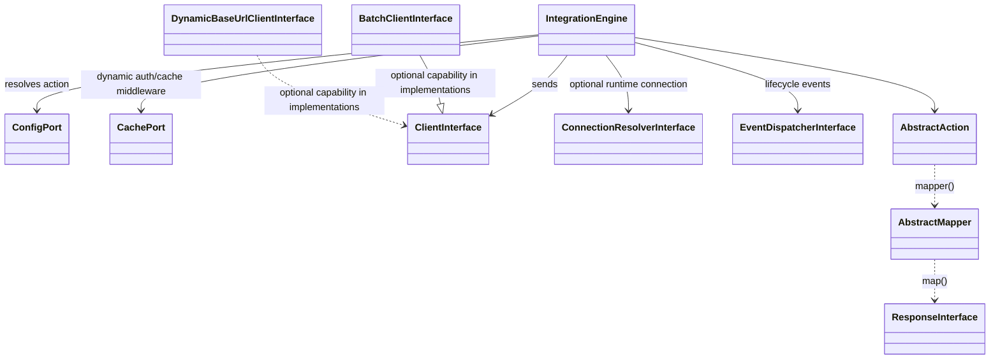
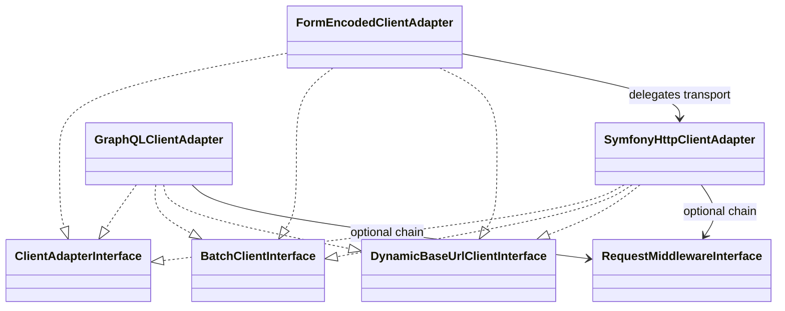
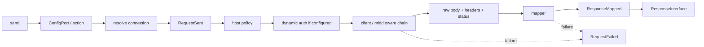
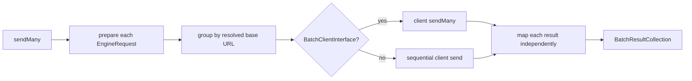
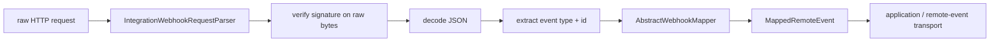

# Class relationship graph

This is a navigation aid, not a second architecture specification. The invariants and dependency rules live in [ARCHITECTURE.md](../../ARCHITECTURE.md); this page shows the current major runtime relationships.

## Engine and ports

`BatchClientInterface` and `DynamicBaseUrlClientInterface` are capabilities detected at runtime; they do not replace `ClientInterface`.

## Built-in clients

The form adapter delegates to `SymfonyHttpClientAdapter`, so its request middleware and batch behavior follow the same transport path.

## Single request flow

`RequestSent` marks the prepared engine dispatch, not proof that bytes already reached the network. `RequestFailed` is emitted for failed execution/mapping paths handled by the engine.

## Batch flow

The three built-in clients take the batch path. Configured request middleware causes their adapters to use their own sequential fallback before returning results.

## Webhook path

IntegrationEngine v8 exposes the verified event ID and typed event but deliberately does not provide durable idempotency. That boundary belongs to the consuming application.

## Symfony bundle wiring

`IntegrationCompilerPass` creates one engine service per configured integration. The bundle wires the config adapter, selected client, cache adapter, optional connection resolver, middleware chains and lifecycle dispatcher dependencies. Protocol adapters are discovered through the `integration_engine.client_adapter` tag; request middleware uses its own bundle tag.

For exact configuration keys, use [HTTP clients](clients.md) and [DOCUMENTATION.md](../../DOCUMENTATION.md), not this graph.
