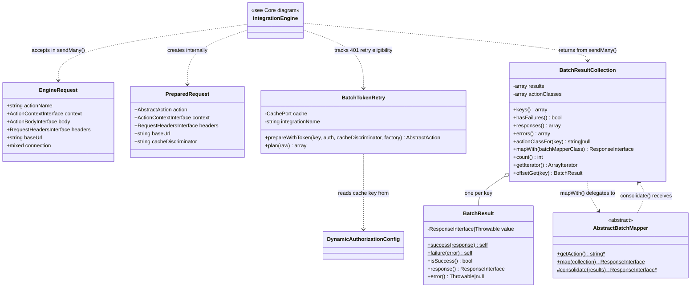
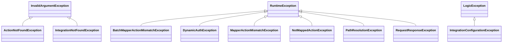
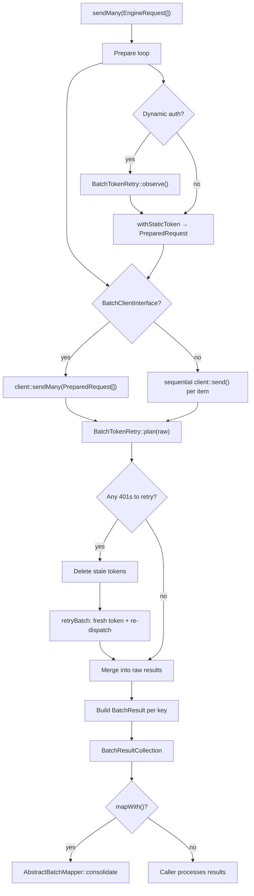

# Class Relationship Graph

Render with any Mermaid-compatible viewer (GitHub, PhpStorm, mermaid.live).

## Core: contracts and engine

```mermaid
classDiagram
    direction TB

    class IntegrationEngine {
        -ConfigPort config
        -ClientInterface client
        -CachePort cache
        -string integrationName
        -ConnectionResolverInterface connectionResolver
        +send(actionName, context?, body?, headers?, baseUrl?, connection?) ResponseInterface
        +sendMany(requests) BatchResultCollection
        +sendManyOrFail(requests) array
        -resolveForDispatch(action, connection, baseUrl, connectionCache) array
        -resolveConnection(connection, connectionCache) ConnectionCredentials
        -applyConnectionAuthorization(action, credentials) AbstractAction
        -dispatchBatch(prepared) array
        -retryBatch(raw, toRetry, prepared) array
        -applyMapper(action, body, headers) ResponseInterface
    }

    class IntegrationRegistry {
        -array~string,IntegrationEngine~ integrations
        +register(name, integration) void
        +get(name) IntegrationEngine
        +has(name) bool
    }

    class IntegrationName {
        <<interface>>
        +NAME const
    }

    class AbstractAction {
        <<abstract>>
        -string method
        -string path
        -ActionBodyInterface body
        -AuthorizationConfig authorization
        +create(method, path, body?, authorization?)$ static
        +getPath(context?) string
        +getRawPath() string
        +getName()$ string*
        +hasResponse()$ bool*
        +mapper()$ string*
    }

    class AbstractMapper {
        <<abstract>>
        +getAction()$ string*
        +map(action, response, headers?) ResponseInterface
        #transform(action, response, headers)$ ResponseInterface*
    }

    class ResponseInterface {
        <<interface>>
        +toArray() array
    }

    class EmptyResponse

    class ActionContextInterface {
        <<interface>>
        +create(data)$ self
        +toArray() array
    }

    class PathResolvableContextInterface {
        <<interface>>
        +resolvePath(path) string|null
    }

    class DefaultActionContext

    class ActionBodyInterface {
        <<interface>>
        +create(data)$ self
        +toArray() array
    }

    class GraphQLBodyInterface {
        <<interface>>
        +getQuery() string
        +getVariables() array
    }

    class RequestHeadersInterface {
        <<interface>>
        +toArray() array
    }

    class AuthorizationConfig {
        <<abstract>>
        +string type
        +fromArray(config)$ self
    }

    class StaticAuthorizationConfig {
        +array params
    }

    class DynamicAuthorizationConfig {
        +string action
        +string tokenField
        +int ttl
        +string header
        +string prefix
    }

    class ConfigPort {
        <<interface>>
        +getAction(name, bodyData) AbstractAction
    }

    class CachePort {
        <<interface>>
        +get(key) mixed
        +set(key, value, ttl) void
        +delete(key) void
    }

    class ClientInterface {
        <<interface>>
        +send(action, context?, headers?) array~body, headers~
    }

    class BatchClientInterface {
        <<interface>>
        +sendMany(requests) array
    }

    class ClientAdapterInterface {
        <<interface>>
        +getClientType()$ string
        +requiresPath()$ bool
        +requiresMethod()$ bool
    }

    class ConnectionResolverInterface {
        <<interface>>
        +resolve(connection) ConnectionCredentials
    }

    class ConnectionCredentials {
        +string baseUrl
        +AuthorizationConfig authorization
        +string connectionId
    }

    class ConnectionResolutionException

    class RequestMiddlewareInterface {
        <<interface>>
        +handle(request, next) array~body, headers~
    }

    class Request {
        +string method
        +string url
        +array headers
        +array body
        +withHeader(name, value) self
    }

    IntegrationRegistry o-- IntegrationEngine : registers by name
    IntegrationEngine --> ConfigPort : getAction()
    IntegrationEngine --> ClientInterface : send()
    IntegrationEngine --> CachePort : token cache
    IntegrationEngine --> AbstractMapper : applyMapper()
    IntegrationEngine --> EmptyResponse : when hasResponse() = false
    IntegrationEngine ..> DynamicAuthorizationConfig : detects
    IntegrationEngine ..> StaticAuthorizationConfig : rebuilds action with
    IntegrationEngine ..> BatchClientInterface : detects for sendMany()
    IntegrationEngine --> ConnectionResolverInterface : resolve(connection)
    IntegrationEngine ..> ConnectionResolutionException : throws when unconfigured
    ConnectionResolverInterface ..> ConnectionCredentials : returns
    ClientAdapterInterface ..> RequestMiddlewareInterface : runs before transport
    RequestMiddlewareInterface ..> Request : inspects/modifies

    AbstractAction --> AuthorizationConfig : authorization
    AbstractAction --> ActionBodyInterface : body
    AbstractAction ..> ActionContextInterface : getPath(context)
    AbstractAction ..> PathResolvableContextInterface : custom path resolution
    AbstractAction ..> AbstractMapper : mapper() class-string

    AbstractMapper ..> AbstractAction : validates pairing
    AbstractMapper ..> ResponseInterface : returns

    EmptyResponse ..|> ResponseInterface
    DefaultActionContext ..|> ActionContextInterface
    PathResolvableContextInterface --|> ActionContextInterface
    GraphQLBodyInterface --|> ActionBodyInterface
    StaticAuthorizationConfig --|> AuthorizationConfig
    DynamicAuthorizationConfig --|> AuthorizationConfig
    ClientAdapterInterface --|> ClientInterface
    BatchClientInterface --|> ClientInterface
```



## Batch processing



## Infrastructure: adapters

```mermaid
classDiagram
    direction TB

    class ClientInterface {
        <<interface>>
    }
    class ClientAdapterInterface {
        <<interface>>
    }
    class BatchClientInterface {
        <<interface>>
        +sendMany(requests) array
    }
    class ConfigPort {
        <<interface>>
    }
    class CachePort {
        <<interface>>
    }

    class SymfonyHttpClientAdapter {
        -HttpClientInterface httpClient
        -string baseUrl
        -array defaultHeaders
        -array~RequestMiddlewareInterface~ requestMiddlewares
        +getClientType()$ "rest"
        +requiresPath()$ true
        +requiresMethod()$ true
        +send(action, context?, headers?) array~body, headers~
        +sendMany(requests) array
        -buildOptions(action, headers) array
        -execute(request, path) array~body, headers~
        -consume(response, method, path) array~body, headers~
        -sendManySequentially(requests) array
        -networkError(method, path, e) RequestResponseException
    }

    class GraphQLClientAdapter {
        -HttpClientInterface httpClient
        -string endpointUrl
        -array defaultHeaders
        -array~RequestMiddlewareInterface~ requestMiddlewares
        +getClientType()$ "graphql"
        +requiresPath()$ false
        +requiresMethod()$ false
    }

    class ResolvesAuthHeaders {
        <<trait>>
        #defaultAuthHeaders() array
        -resolveHeaders(action) array
    }

    class RunsRequestMiddlewares {
        <<trait>>
        -dispatchThroughRequestMiddlewares(request, middlewares, terminal) array
    }

    class ClientAdapterResolver {
        -array~string,class-string~ adapters
        +register(clientType, adapterClass) void
        +resolve(clientType) string
        +all() array
    }

    class YamlConfigAdapter {
        -array config
        +getAction(name, bodyData) AbstractAction
    }

    class Psr6CacheAdapter {
        -CacheItemPoolInterface pool
        +get(key) mixed
        +set(key, value, ttl) void
        +delete(key) void
        -sanitizeKey(key) string
    }

    class RequestResponseException {
        +int statusCode
        +string context
    }

    SymfonyHttpClientAdapter ..|> ClientAdapterInterface
    SymfonyHttpClientAdapter ..|> BatchClientInterface
    GraphQLClientAdapter ..|> ClientAdapterInterface
    ClientAdapterInterface --|> ClientInterface
    BatchClientInterface --|> ClientInterface
    SymfonyHttpClientAdapter --* ResolvesAuthHeaders : uses
    GraphQLClientAdapter --* ResolvesAuthHeaders : uses
    SymfonyHttpClientAdapter --* RunsRequestMiddlewares : uses
    GraphQLClientAdapter --* RunsRequestMiddlewares : uses
    SymfonyHttpClientAdapter ..> RequestResponseException : throws
    GraphQLClientAdapter ..> RequestResponseException : throws
    ClientAdapterResolver o-- ClientAdapterInterface : type → class map
    YamlConfigAdapter ..|> ConfigPort
    Psr6CacheAdapter ..|> CachePort
```



## Bundle: wiring and generator

```mermaid
classDiagram
    direction TB

    class IntegrationEngineBundle {
        +build(container) void
    }

    class IntegrationEngineExtension {
        +load(configs, container) void
    }

    class Configuration {
        +getConfigTreeBuilder() TreeBuilder
    }

    class IntegrationCompilerPass {
        +process(container) void
    }

    class MakeIntegrationCommand {
        -string projectDir
        -IntegrationFileGenerator generator
        -ClientAdapterResolver adapterResolver
    }

    class IntegrationFileGenerator
    class IntegrationContext
    class TemplateRenderer
    class IntegrationConfigurationException

    IntegrationEngineBundle --> IntegrationCompilerPass : addCompilerPass()
    IntegrationEngineExtension --> Configuration : processConfiguration()
    IntegrationCompilerPass --> ClientAdapterResolver : register adapters
    IntegrationCompilerPass --> YamlConfigAdapter : one per integration
    IntegrationCompilerPass --> IntegrationEngine : one per integration
    IntegrationCompilerPass --> IntegrationRegistry : register(name, engine)
    IntegrationCompilerPass ..> IntegrationConfigurationException : throws
    IntegrationCompilerPass ..> ConnectionResolverInterface : wires connection_resolver:
    IntegrationCompilerPass ..> RequestMiddlewareInterface : wires request_middlewares: (built-in adapters only)
    MakeIntegrationCommand --> IntegrationFileGenerator : generates files
    MakeIntegrationCommand --> ClientAdapterResolver : resolve client type
    IntegrationFileGenerator --> TemplateRenderer : renders stubs
    IntegrationFileGenerator ..> IntegrationContext : consumes
```

## Exception hierarchy



## Runtime data flow — single request

```mermaid
flowchart LR
    A[Application service] --> B["IntegrationRegistry::get(NAME)"]
    B --> C[IntegrationEngine]
    C --> D["ConfigPort::getAction()<br/>resolves body-sourced path placeholders"]
    D --> D2{"connection given?"}
    D2 -- yes --> D3["ConnectionResolverInterface::resolve()<br/>→ ConnectionCredentials"]
    D3 --> E{Dynamic auth?}
    D2 -- no --> E
    E -- yes --> F["CachePort: token hit?<br/>(keyed per connection)"]
    F -- miss --> G[Token action via ClientInterface + Mapper]
    G --> H[Cache token + rebuild action as static auth]
    F -- hit --> H
    E -- no --> I["ClientInterface::send()"]
    H --> I
    I --> I2["adapter resolves Request, runs request_middlewares, dispatches"]
    I2 --> J{"hasResponse()?"}
    J -- no --> K[EmptyResponse]
    J -- yes --> L["AbstractMapper::map(action, body, headers)"]
    L --> M[Typed ResponseInterface DTO]
```



## Runtime data flow — batch


