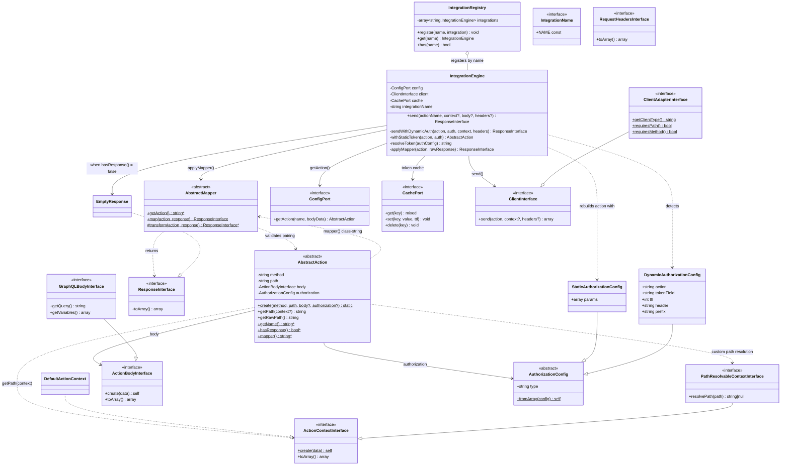
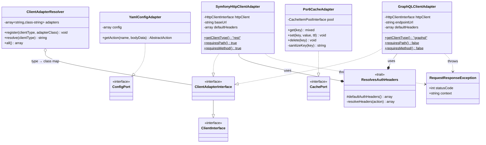
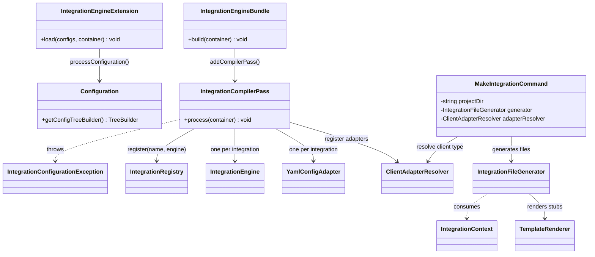
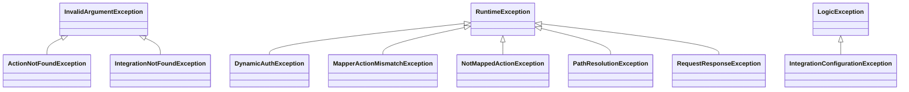
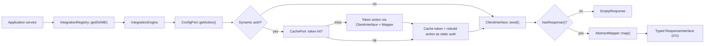

# Class Relationship Graph

Generated overview of the bundle's class relationships. Render with any
Mermaid-compatible viewer (GitHub, PhpStorm, mermaid.live).

## Core: contracts and engine

## Infrastructure: adapters

## Bundle: wiring and generator

## Exception hierarchy

## Runtime data flow

