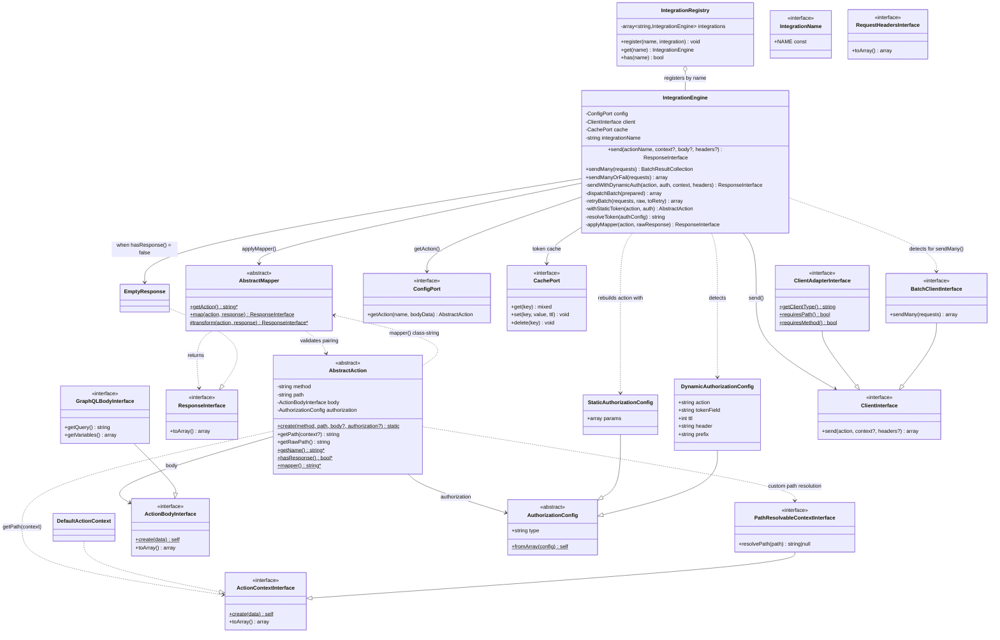
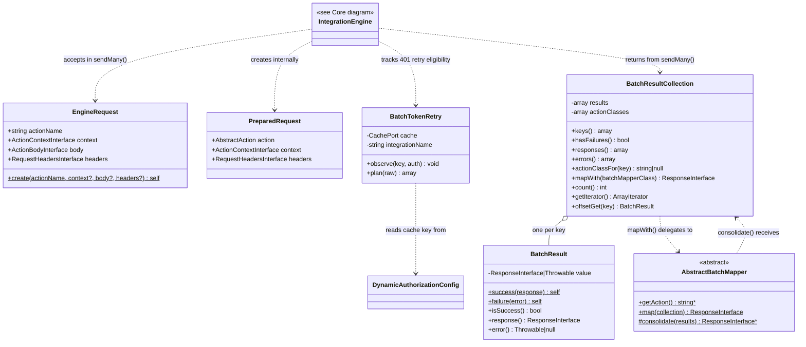
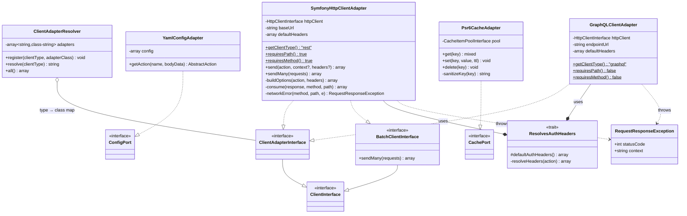
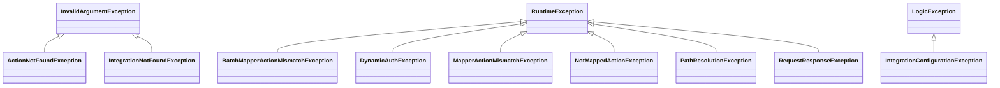
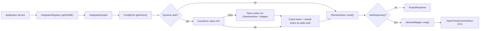
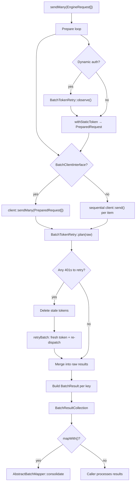

# Class Relationship Graph

Render with any Mermaid-compatible viewer (GitHub, PhpStorm, mermaid.live).

## Core: contracts and engine

## Batch processing

## Infrastructure: adapters

## Bundle: wiring and generator

## Exception hierarchy

## Runtime data flow — single request

## Runtime data flow — batch

